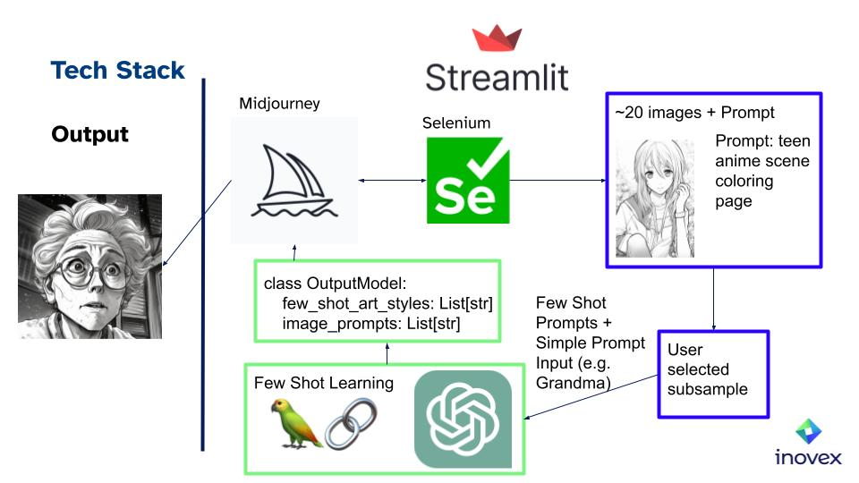

# midjourney-prompt-generator
[Streamlit application](https://midjourney-prompt-generator.streamlit.app/) for a midjourney prompt generator demo. 

Basic idea: Using a GPT model (atm. ChatGPT) via langchain library and let it learn with a few shot learning technique how Midjourney prompts can be generated.

## Tech Stack
* Crawling: Selenium
* Frontend: Streamlit
* Prompt Engineering/Few Shot Learning: LangChain

[Source code llm-few-shot-generator](https://github.com/FloTeu/llm-few-shot-generator)



## Example
Text Prompt Input: "Grandma" 

Midjourney Prompt Generator output images:


## Local Setup

### Prerequisites
Create a [streamlit secret](https://docs.streamlit.io/streamlit-community-cloud/get-started/deploy-an-app/connect-to-data-sources/secrets-management) TOML file before running this app locally.
```console
mkdir .streamlit
printf 'open_ai_api_key = ""' > .streamlit/secrets.toml
```
If it not exists yet, you have to create a open ai api key:
1. openai api key: https://platform.openai.com/account/api-keys

### Run
Optionally set environment variable DEBUG = 1, in order to run selenium without headless mode
```console
streamlit run app.py
```